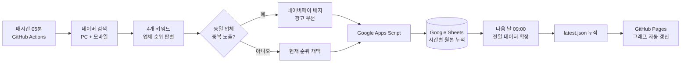

# 네이버 경쟁사 검색 순위 분석 대시보드

[](https://github.com/yoojuyoung625/naver-competitor-ranking-dashboard/actions/workflows/hourly-collection.yml)
[](https://github.com/yoojuyoung625/naver-competitor-ranking-dashboard/actions/workflows/daily-finalize.yml)
[](https://github.com/yoojuyoung625/naver-competitor-ranking-dashboard/actions/workflows/deploy-pages.yml)

### [대시보드 바로 열기](https://yoojuyoung625.github.io/naver-competitor-ranking-dashboard/)

키워드·디바이스·시간대별 경쟁사 노출 순위를 수집하고 비교하는 분석 도구입니다. 기존 폐쇄망용 보고서의 정보 구조를 기준으로, 유지보수 가능한 React·TypeScript 프로젝트로 처음부터 다시 구성했습니다.

## 자동 업데이트 흐름



GitHub Actions의 실행 상태와 각 단계의 로그·스크린샷은 저장소의 [Actions 화면](https://github.com/yoojuyoung625/naver-competitor-ranking-dashboard/actions)에서 확인할 수 있습니다.

## 현재 구현

- 키워드, PC·모바일·통합, 월별 필터
- 평균 순위, 수집 성공률, 표본 수 KPI
- 업체별 고정 색상을 적용한 완만한 순위 추이 그래프
- 업체별 평균 순위·1위 점유율·노출률 비교
- 관측 평균순위·노출 관측률·1위 관측률 분리 표시
- 업체 클릭 집중 분석
- 모바일·태블릿 반응형 레이아웃
- 수집 결과와 실패 이력을 보존하는 데이터 계약
- 증빙 스크린샷을 분리 보관하는 API 설계

## 파일 구조

```text
DESIGN.md                 화면·데이터·보안 설계 기준
src/types.ts              공통 데이터 타입
src/config.ts             키워드·업체·색상·시간대 설정
src/data/sample.ts        공개용 샘플 데이터
src/lib/analytics.ts      평균 순위와 점유율 계산
src/components/           필터·차트·표 컴포넌트
src/App.tsx               대시보드 화면 조합
collector/                예약 수집 및 캡처 인터페이스
scripts/                  네이버 시간별 수집·전일 확정 실행기
apps-script/              사용자 소유 Google Sheets 저장 API
.github/workflows/        시간별 수집·전일 확정·Pages 배포
server/schema.sql         누적 저장 스키마
server/API.md             조회·재시도·스크린샷 API 계약
```

## 실행

```bash
pnpm install
pnpm dev
```

개발 화면은 기본적으로 `http://localhost:5173`에서 열립니다.

## 빌드

```bash
pnpm build
```

생성된 `dist` 폴더는 GitHub Pages 같은 정적 호스팅에 배포할 수 있습니다.

## 수집 기준

1. 매시간 PC·모바일 검색 결과 수집
2. 네이버 파워링크 영역의 실제 노출 순서 사용
3. 동일 업체가 중복되면 네이버페이 배지가 보이는 광고 우선
4. 업체명과 광고 도메인 매핑으로 회사 판별
5. CAPTCHA 또는 접근 제한은 우회하지 않고 실패 기록
6. 증빙 스크린샷은 GitHub Actions 아티팩트로 7일 보관

## 평균순위 산식

- 관측 평균순위: `유효 순위 합계 ÷ 유효 관측 건수`
- 노출 관측률: `업체가 발견된 정상 수집 구간 수 ÷ 전체 정상 수집 구간 수`
- 1위 관측률: `업체가 1위로 발견된 정상 수집 구간 수 ÷ 전체 정상 수집 구간 수`
- 수집 실패와 미노출은 관측 평균에서 제외합니다.
- 경쟁사의 실제 노출수는 공개되지 않으므로 노출수 가중 평균을 임의로 만들지 않습니다.
- 내부 계산은 원래 정밀도로 유지하고 화면과 다운로드에서는 소수점 첫째 자리까지 표시합니다.

CAPTCHA 또는 접근 제한을 우회하는 기능은 구현하지 않습니다.

예약 시각은 GitHub Actions의 UTC 기준으로 설정되어 있습니다.

- 매시 5분: PC·모바일 순위 수집 및 원본 누적
- 매일 00:00 UTC = 한국시간 오전 9시: 전일 데이터 확정 및 `latest.json` 갱신
- GitHub 예약 작업은 플랫폼 상황에 따라 몇 분 정도 지연될 수 있습니다.

## Google Apps Script 연결

기존 보고서의 Apps Script 주소는 사용하지 않습니다. 본인 계정에서 새 웹 앱을 만든 뒤 서버의 `.env`에만 다음 값을 입력합니다.

```env
COLLECTOR_GAS_WEB_APP_URL=https://script.google.com/macros/s/본인_배포_ID/exec
COLLECTOR_SHARED_SECRET=충분히_긴_임의값
```

Apps Script 주소와 공유 비밀값을 `src` 파일, GitHub Actions 로그 또는 공개 HTML에 직접 작성하지 않습니다. 브라우저는 Apps Script를 직접 호출하지 않고 내부 서버 API를 통해 필요한 집계 데이터만 조회하도록 구성합니다.

## 보안

- 비밀키는 `.env`에만 저장하며 Git에 커밋하지 않습니다.
- 실제 스크린샷과 내부 원본 데이터는 `screenshots/`, `data/private/`에 저장하며 Git에서 제외합니다.
- 브라우저로 전달되는 환경변수에는 비밀값을 넣지 않습니다.
- Apps Script 주소·공유 비밀값·원본 Google Sheets는 공개 저장소에 포함하지 않습니다.
- 오전 9시에 확정된 대시보드용 순위 데이터만 GitHub Pages 갱신에 사용합니다.
