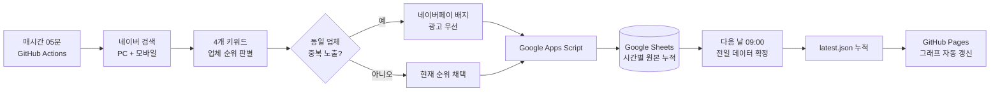

# 네이버 경쟁사 검색 순위 분석 대시보드

[](https://github.com/yoojuyoung625/naver-competitor-ranking-dashboard/actions/workflows/hourly-collection.yml)
[](https://github.com/yoojuyoung625/naver-competitor-ranking-dashboard/actions/workflows/daily-finalize.yml)
[](https://github.com/yoojuyoung625/naver-competitor-ranking-dashboard/actions/workflows/deploy-pages.yml)

### [대시보드 바로 열기](https://yoojuyoung625.github.io/naver-competitor-ranking-dashboard/)

키워드·디바이스·시간대별 경쟁사 노출 순위를 수집하고 비교하는 분석 도구입니다. 기존 폐쇄망용 보고서의 정보 구조를 기준으로, 유지보수 가능한 React·TypeScript 프로젝트로 처음부터 다시 구성했습니다.

## 자동 업데이트 흐름



GitHub Actions의 실행 상태와 각 단계의 로그·스크린샷은 저장소의 [Actions 화면](https://github.com/yoojuyoung625/naver-competitor-ranking-dashboard/actions)에서 확인할 수 있습니다.

## 현재 구현

- 키워드, PC·모바일·통합, 월별 필터
- 일자별·주차별·월별 관측 평균순위
- 업체별 고정 색상을 적용한 완만한 순위 추이 그래프
- 전월 평균·당월 주차 평균·당월 평균·WoW·MoM 통합 비교
- 시장 선두 구조·순위 수준·업무/비업무 집중도·시간대 편차·전월 증감을 반영한 자동 전략 코멘트
- 업체 클릭 집중 분석
- 모바일·태블릿 반응형 레이아웃
- 수집 결과와 실패 이력을 보존하는 데이터 계약
- 증빙 스크린샷을 분리 보관하는 API 설계

## 파일 구조

```text
DESIGN.md                 화면·데이터·보안 설계 기준
src/types.ts              공통 데이터 타입
src/config.ts             키워드·업체·색상·시간대 설정
src/data/sample.ts        공개용 샘플 데이터
src/lib/analytics.ts      평균 순위와 점유율 계산
src/components/           필터·차트·표 컴포넌트
src/App.tsx               대시보드 화면 조합
collector/                예약 수집 및 캡처 인터페이스
scripts/                  네이버 시간별 수집·전일 확정 실행기
apps-script/              사용자 소유 Google Sheets 저장 API
.github/workflows/        시간별 수집·전일 확정·Pages 배포
server/schema.sql         누적 저장 스키마
server/API.md             조회·재시도·스크린샷 API 계약
```

## 실행

```bash
pnpm install
pnpm dev
```

개발 화면은 기본적으로 `http://localhost:5173`에서 열립니다.

## 빌드

```bash
pnpm build
```

생성된 `dist` 폴더는 GitHub Pages 같은 정적 호스팅에 배포할 수 있습니다.

## 수집 기준

1. 매시간 PC·모바일 검색 결과 수집
2. 네이버 파워링크 영역의 실제 노출 순서 사용
3. 동일 업체가 중복되면 네이버페이 배지가 보이는 광고 우선
4. 업체명과 광고 도메인 매핑으로 회사 판별
5. CAPTCHA 또는 접근 제한은 우회하지 않고 실패 기록
6. 증빙 스크린샷은 GitHub Actions 아티팩트로 7일 보관

## 평균순위는 어떻게 가져오고 계산하나요?

이 대시보드의 평균순위는 네이버가 제공하는 경쟁사 노출수 통계나 별도의 평균순위 API 값이 아닙니다. 예약 수집기가 같은 조건으로 네이버 통합검색 결과를 반복 확인하고, 파워링크에 실제로 나타난 순서를 시간별 원본으로 저장한 뒤 그 유효 관측값을 평균냅니다.

### 1. 시간별 원본 수집

1. GitHub Actions가 매시간 05분에 실행됩니다.
2. 설정된 4개 키워드를 PC와 모바일 조건으로 각각 검색합니다.
3. 파워링크 영역을 위에서 아래로 읽어 실제 노출 순서를 `1위, 2위, 3위…`로 기록합니다.
4. 광고 제목·업체명·연결 도메인 매핑으로 삼성, KB, DB, 현대, AXA, 캐롯을 판별합니다.
5. 한 검색 결과에 같은 업체가 두 번 나오면, 요청 기준에 따라 **네이버페이 배지가 표시된 광고를 대표 관측값으로 우선 채택**합니다.
6. 수집 시각, 키워드, 디바이스, 업체, 순위, 노출 위치, 네이버페이 여부, 수집 상태를 Google Sheets에 원본으로 누적합니다.

### 2. 유효 관측값만 사용

- 정상적으로 순위가 확인된 행만 평균 계산에 포함합니다.
- CAPTCHA, 접속 제한, 화면 구조 변경 등으로 수집이 실패한 시점은 실패 이력으로 남기고 평균에서 제외합니다.
- 특정 업체가 검색 결과에서 확인되지 않은 시점도 임의의 꼴찌 순위를 부여하지 않고 결측값으로 둡니다.
- 따라서 이 수치는 **업체가 실제로 관측된 시간들의 관측 평균순위**입니다.
- 경쟁사의 실제 광고 노출수는 외부에서 알 수 없으므로 `노출수 가중 평균순위`를 추정하거나 만들어내지 않습니다.

### 3. 평균 산식

```text
관측 평균순위 = 유효 순위의 합계 ÷ 유효 순위 관측 건수
```

예를 들어 같은 조건에서 한 업체가 `1위, 2위, 2위`로 관측되면 `(1 + 2 + 2) ÷ 3 = 1.666…`이며 화면에는 **1.7위**로 표시됩니다. 계산 중에는 원래 소수 정밀도를 유지하고, 표·그래프·다운로드에서만 소수점 첫째 자리로 반올림합니다.

### 4. 화면별 집계 범위

- **일자별 평균:** 같은 날짜·선택 키워드·선택 디바이스에 속한 유효 시간별 순위의 산술평균
- **주차별 평균:** 선택 월의 `1~7일, 8~14일, 15~21일, 22~28일, 29일~말일` 단위 유효 순위의 산술평균
- **월별 평균:** 선택 월 전체 유효 순위의 산술평균
- **통합 디바이스:** PC와 모바일 유효 관측값을 한 모집단으로 합쳐 산술평균
- **통합 키워드:** 선택된 복수 키워드의 유효 관측값을 한 모집단으로 합쳐 산술평균
- **시간대 평균:** 새벽·출근·오전·점심·오후·퇴근·심야 구간에 해당하는 유효 관측값의 산술평균

### 5. WoW와 MoM 표시 기준

- **WoW:** 최신 주차 평균과 직전 주차 평균을 비교합니다. 월 첫 주만 있는 경우에는 전월의 마지막 7개 수집일을 직전 주로 사용합니다.
- **MoM:** 선택 월 전체평균과 직전 월 전체평균을 비교합니다.
- 순위 숫자는 낮을수록 좋으므로, 개선은 파란색 `+개선 폭`, 악화는 빨간색 `△악화 폭`으로 표시합니다.
- 직전 기간 데이터가 없으면 비교값은 `-`로 표시되며, 과거 데이터를 임의로 보간하지 않습니다.

### 6. 전일 확정과 누적

매일 오전 9시(한국시간)에 전일 원본을 확정하여 `latest.json`에 누적합니다. 확정된 과거 날짜는 새 수집으로 덮어쓰지 않으며, 대시보드는 누적 데이터 중 최근 3개월 버튼을 자동으로 표시합니다. 8월처럼 저장된 원본이 전혀 없는 달은 전월 평균과 MoM이 비어 있는 것이 정상입니다.

CAPTCHA 또는 접근 제한을 우회하는 기능은 구현하지 않습니다.

예약 시각은 GitHub Actions의 UTC 기준으로 설정되어 있습니다.

- 매시 5분: PC·모바일 순위 수집 및 원본 누적
- 매일 00:00 UTC = 한국시간 오전 9시: 전일 데이터 확정 및 `latest.json` 갱신
- GitHub 예약 작업은 플랫폼 상황에 따라 몇 분 정도 지연될 수 있습니다.

## Google Apps Script 연결

기존 보고서의 Apps Script 주소는 사용하지 않습니다. 본인 계정에서 새 웹 앱을 만든 뒤 서버의 `.env`에만 다음 값을 입력합니다.

```env
COLLECTOR_GAS_WEB_APP_URL=https://script.google.com/macros/s/본인_배포_ID/exec
COLLECTOR_SHARED_SECRET=충분히_긴_임의값
```

Apps Script 주소와 공유 비밀값을 `src` 파일, GitHub Actions 로그 또는 공개 HTML에 직접 작성하지 않습니다. 브라우저는 Apps Script를 직접 호출하지 않고 내부 서버 API를 통해 필요한 집계 데이터만 조회하도록 구성합니다.

## 보안

- 비밀키는 `.env`에만 저장하며 Git에 커밋하지 않습니다.
- 실제 스크린샷과 내부 원본 데이터는 `screenshots/`, `data/private/`에 저장하며 Git에서 제외합니다.
- 브라우저로 전달되는 환경변수에는 비밀값을 넣지 않습니다.
- Apps Script 주소·공유 비밀값·원본 Google Sheets는 공개 저장소에 포함하지 않습니다.
- 오전 9시에 확정된 대시보드용 순위 데이터만 GitHub Pages 갱신에 사용합니다.
